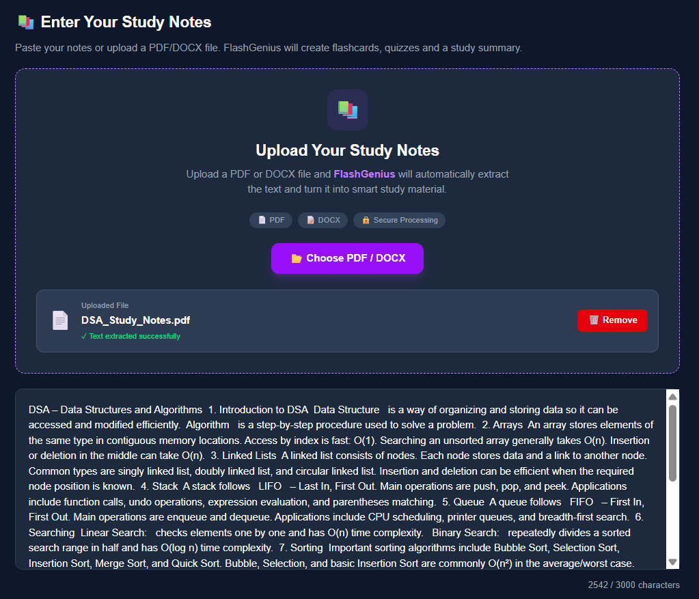
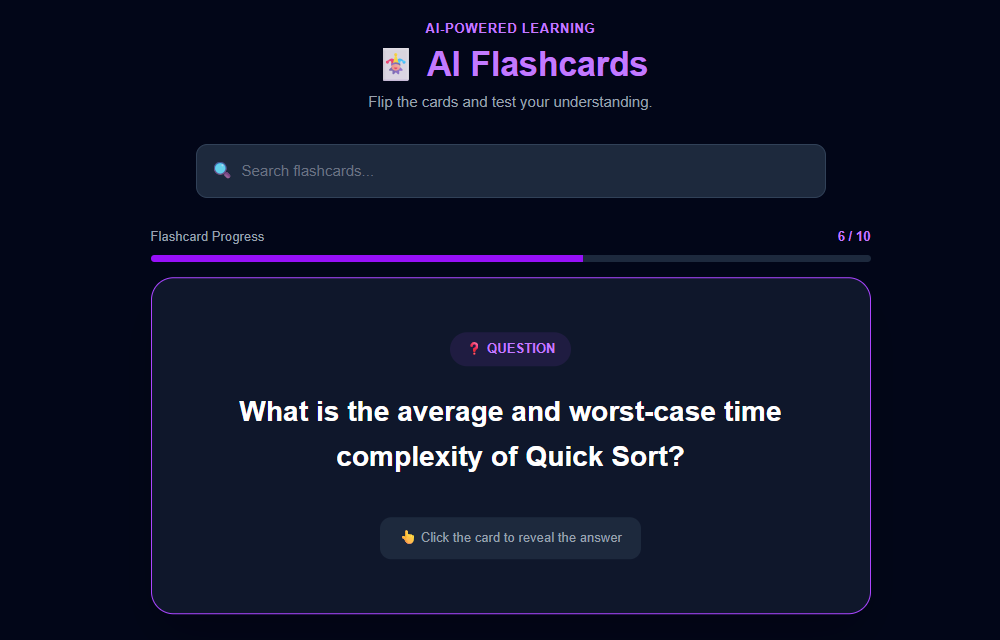
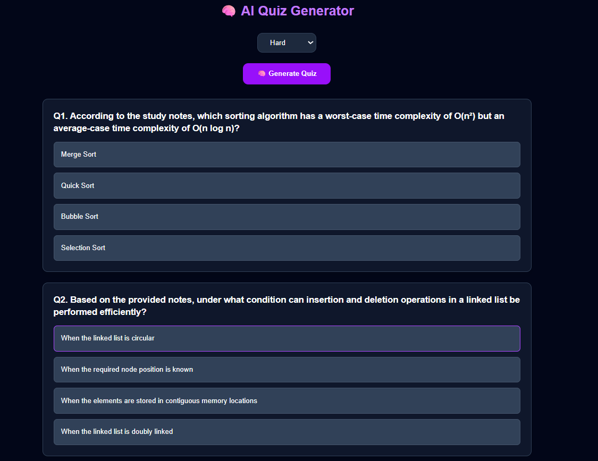
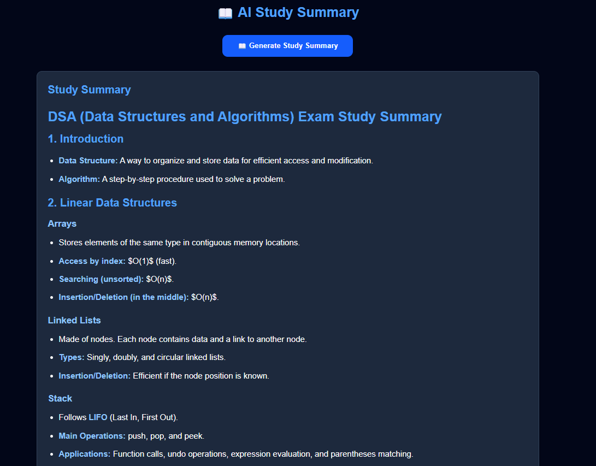

# ⚡ FlashGenius

### AI-Powered Flashcard, Quiz & Study Summary Generator

FlashGenius is a full-stack AI-powered study assistant that transforms study notes and uploaded documents into **flashcards, quizzes, and concise study summaries**.

Students can paste notes or upload PDF/DOCX documents, and FlashGenius uses the **Google Gemini API** to generate interactive learning material.

🌐 **Live Demo:** https://flash-genius-two.vercel.app

---

## 📌 Project Overview

Creating flashcards, quizzes, and revision notes manually can take a lot of time.

**FlashGenius automates this process using Generative AI.**

Users can:

- Paste study notes
- Upload PDF documents
- Upload DOCX documents
- Generate AI flashcards
- Generate MCQ quizzes
- Generate study summaries
- Download generated study material

---

## ✨ Features

### 🧠 AI Flashcard Generator

Automatically generates **10 question-and-answer flashcards** from the provided study material.

- AI-generated questions and answers
- Interactive card flipping
- Previous/next navigation
- Flashcard search
- Progress tracking

### 📝 AI Quiz Generator

Creates interactive multiple-choice quizzes from study notes.

- AI-generated MCQs
- Easy, Medium, and Hard difficulty levels
- Interactive answer selection
- Automatic score calculation
- Quiz result feedback

### 📚 AI Study Summary

Generates a structured and concise summary from long study notes to help with quick revision.

### 📄 PDF & DOCX Upload

Users can upload study documents directly.

Supported formats:

- PDF
- DOCX

FlashGenius extracts the text from the uploaded document and uses it for AI generation.

### 📥 Download Study Material

Generated learning material can be downloaded for offline study and revision.

### 🌗 Light / Dark Mode

The application includes a theme switcher for light and dark interfaces.

---

## 🛠️ Tech Stack

### Frontend

- React
- Vite
- JavaScript
- CSS
- Axios
- Lucide React

### Backend

- Python
- FastAPI
- Uvicorn
- Pydantic

### Artificial Intelligence

- Google Gemini API
- Gemini 2.5 Flash

### Document Processing

- PyPDF
- python-docx

### Deployment & Development

- Vercel
- Render
- Git
- GitHub

---

## 🏗️ System Architecture

```text
┌──────────────────────┐
│        User          │
└──────────┬───────────┘
           │
           ▼
┌──────────────────────┐
│   React + Vite UI    │
│      (Vercel)        │
└──────────┬───────────┘
           │
      HTTPS / Axios
           │
           ▼
┌──────────────────────┐
│   FastAPI Backend    │
│       (Render)       │
└──────┬────────┬──────┘
       │        │
       ▼        ▼
┌─────────────┐  ┌───────────────┐
│ Gemini API  │  │ PDF/DOCX      │
│             │  │ Processing    │
└─────────────┘  └───────────────┘
```

---

## 🔄 Application Workflow

```text
Study Notes / PDF / DOCX
          │
          ▼
   Text Processing
          │
          ▼
 Select Learning Tool
          │
    ┌─────┼─────┐
    ▼     ▼     ▼
 Flash  Quiz  Summary
 Cards
    │     │     │
    └─────┼─────┘
          ▼
    Gemini API
          │
          ▼
 AI-Generated Content
          │
          ▼
     React UI
          │
          ▼
   Study / Download
```

---

## 📂 Project Structure

```text
FlashGenius/
│
├── backend/
│   ├── app/
│   │   └── main.py
│   └── requirements.txt
│
├── frontend/
│   ├── src/
│   │   ├── services/
│   │   │   └── api.js
│   │   ├── App.jsx
│   │   └── main.jsx
│   ├── package.json
│   └── vite.config.js
│
├── screenshots/
│   ├── document-upload.png
│   ├── flashcards.png
│   ├── quiz.png
│   └── summary.png
│
├── .gitignore
└── README.md
```

---

## 🔌 API Endpoints

| Method | Endpoint | Purpose |
| --- | --- | --- |
| `GET` | `/` | Backend health/root endpoint |
| `POST` | `/generate` | Generate AI flashcards |
| `POST` | `/generate-quiz` | Generate an AI quiz |
| `POST` | `/generate-summary` | Generate a study summary |

---

## 📸 Screenshots

### 📄 PDF/DOCX Upload & Text Extraction

Upload PDF or DOCX study material and automatically extract its text.



### 🧠 AI Flashcards

Generate 10 interactive AI-powered flashcards from study material.



### 📝 AI Quiz Generator

Generate multiple-choice quizzes with Easy, Medium, and Hard difficulty levels.



### 📚 AI Study Summary

Generate a structured study summary from uploaded or pasted notes.



---

## ⚙️ Run Locally

### 1. Clone the Repository

```bash
git clone https://github.com/Mateebuddin/FlashGenius.git
cd FlashGenius
```

### 2. Start the Frontend

```bash
cd frontend
npm install
npm run dev
```

The frontend normally runs at:

```text
http://localhost:5173
```

### 3. Start the Backend

Open another terminal:

```bash
cd backend
python -m venv venv
```

On Windows:

```bash
venv\Scripts\activate
```

Install dependencies:

```bash
pip install -r requirements.txt
```

Create:

```text
backend/.env
```

Add:

```env
GEMINI_API_KEY=your_gemini_api_key_here
```

Then start FastAPI:

```bash
uvicorn app.main:app --reload
```

The backend normally runs at:

```text
http://127.0.0.1:8000
```

---

## 🔐 Security

The Gemini API key is stored on the backend using environment variables and is not exposed directly in the frontend.

Never commit real API keys or `.env` files to GitHub.

The project `.gitignore` excludes sensitive environment files and generated dependencies.

---

## 🌐 Deployment

### Frontend

The React + Vite frontend is deployed on **Vercel**.

**Live Application:**  
https://flash-genius-two.vercel.app

### Backend

The FastAPI backend is deployed on **Render**.

The production frontend communicates with the backend through HTTPS API requests, with CORS configured for the required frontend origins.

---

## 🧪 Production Testing

The deployed application has been tested for:

- Flashcard generation
- Quiz generation
- Study summary generation
- PDF upload
- DOCX upload
- Text extraction
- Download functionality
- Frontend-to-backend API communication
- Production CORS configuration

---

## 🚀 Future Improvements

- User authentication
- Database integration
- Save flashcard decks
- Save quiz history
- Spaced-repetition learning
- Study streak tracking
- AI explanations for incorrect answers
- Student progress analytics
- Shareable flashcard decks
- Improved mobile experience

---

## 🎯 Learning Outcomes

Building FlashGenius provided practical experience with:

- Full-stack web development
- React application development
- FastAPI backend development
- REST API integration
- Generative AI integration
- Prompt engineering
- JSON response processing
- PDF/DOCX processing
- Environment variable management
- CORS configuration
- Git and GitHub
- Vercel deployment
- Render deployment
- Production debugging

---

## 👨‍💻 Developer

**Mohammed Mateebuddin**

Computer Science (Data Science) Student

**GitHub:** https://github.com/Mateebuddin

---

## ⭐ Support

If you find FlashGenius useful, consider giving the repository a ⭐.

---

## 📄 License

This project was developed for educational and portfolio purposes.